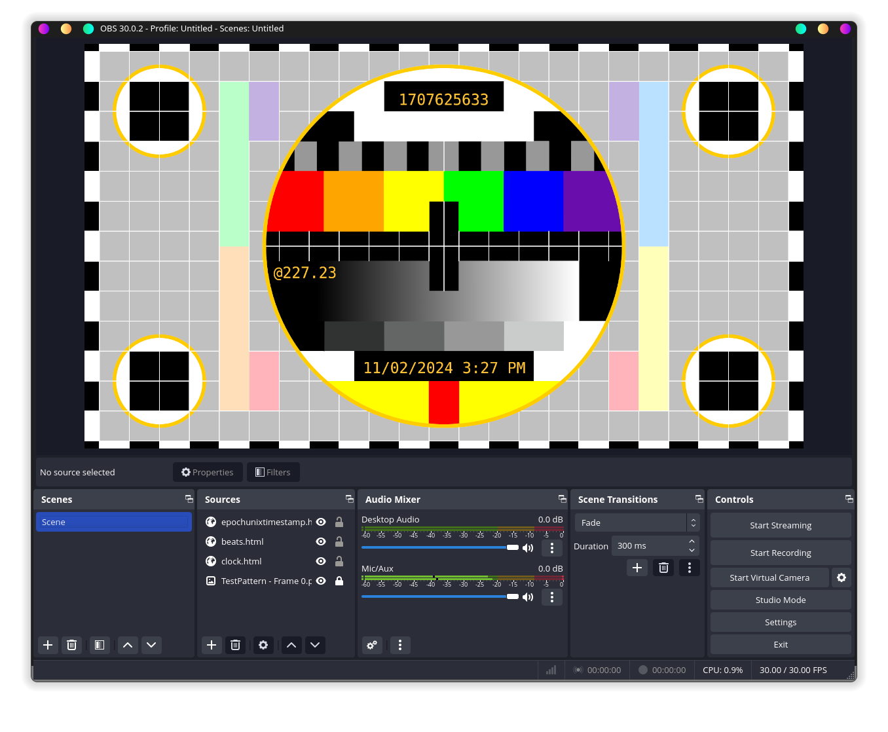

# OBS-clock-overlay
A custom test pattern for OBS.
It should look a little something like this:

has 3 optional date and time thingies

1. Normal date and time
2. Epoch Unix Timestamp
3. Swatch Internet Time (.beats)

beat time (probably works, can be confirmed if time is correct against http://www.swatchclock.com/index.php)
